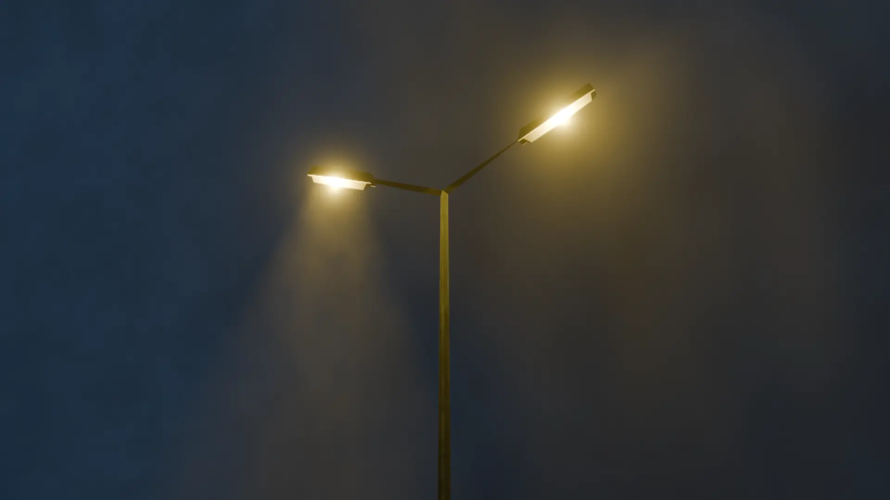
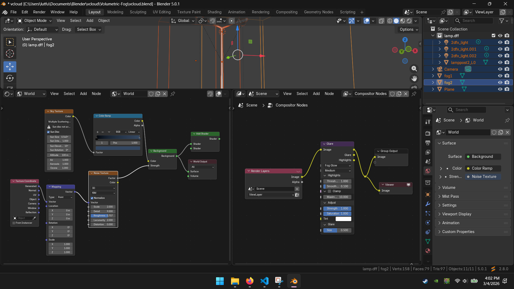

# Volumetric-Fog
Learning Project on Volumetric Fog.  
In this project I aim to learn light glow, ground and volumetric fog in blender.  

<figure>
  
  <figcaption align="center"><i>The left lamp is projecting right through the light source (object focused)</i></figcaption>
   
  <figcaption align="center"><i>The right lamp is focused on environmental fog.</i></figcaption>
  
     
  <figcaption align="center"><i>The following ss shows the nodes I used to make the skybox and glare effect</i></figcaption>
</figure>